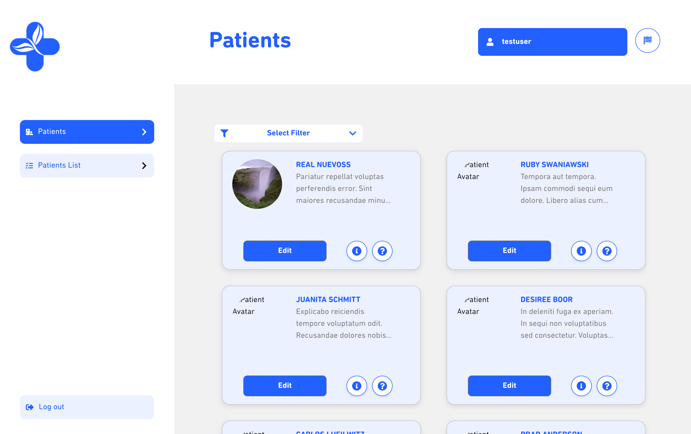

# Patient Management



## Description
This is an application built with **React**, **TypeScript**, and **Vite**. It uses **json-server** to simulate an API and handle login locally.

## Installation

1. Clone the repository:

    ```bash
    git clone <repository-url>
    cd <repository-name>
    ```

2. Install the dependencies:

    ```bash
    npm install
    ```

## Backend Configuration

To simulate the login, **json-server** is used with a `db.json` file.

1. Install json-server globally (if you haven't done so yet):

    ```bash
    npm install -g json-server
    ```

2. Start the API:

    ```bash
    json-server --watch db.json --port 3001
    ```

    > **Note:** Ensure that the `db.json` file contains the necessary credentials for a successful login. Use the following credentials:

    ```json
    {
      "username": "testuser",
      "password": "testpassword"
    }
    ```

## Environment Variables

The application requires environment variables to be set up in a `.env` file. Create a `.env` file in the root directory of your project and add the following variables:


VITE__API__URL=[https://63bedcf7f5cfc0949b634fc8.mockapi.io/users](https://63bedcf7f5cfc0949b634fc8.mockapi.io/users) 

VITE_BACKEND_API_URL=[http://localhost:3001/users](http://localhost:3001/users)


## Design Decisions

- **Style Variables:** A variables file is used to define the main colors and sizes of the application.
- **Libraries Used:**
  -  **React:** For building the user interface.
  -  **TypeScript:** For type control.
  -  **Vite:** For fast and efficient bundling.
  -  **Reactstrap:** To facilitate UI development.
  -  **Sass:** For custom styling.
  -  **Toastify:** For success messages in forms.
  -  **React Hook Form:** For form validation and handling.
  - **Translations:** A translations file is implemented to change the page language between English and Spanish via a flag located in the header.
  - **Data Persistence:** Redux is used for session data persistence.

## Usage

1. Run the application with the command:

    ```bash
    npm start
    ```

2. Access the application in your browser at [http://localhost:5173/](http://localhost:5173).

3. To test the login, ensure json-server is running at [http://localhost:3001](http://localhost:3001) and use the provided credentials.
